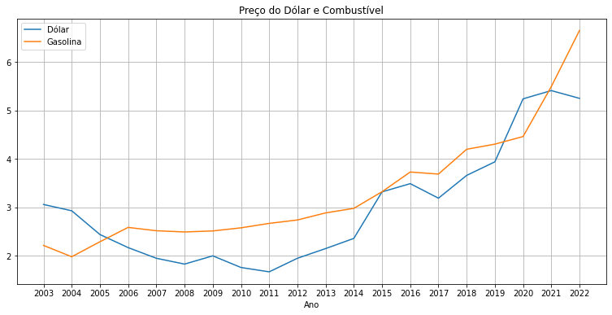
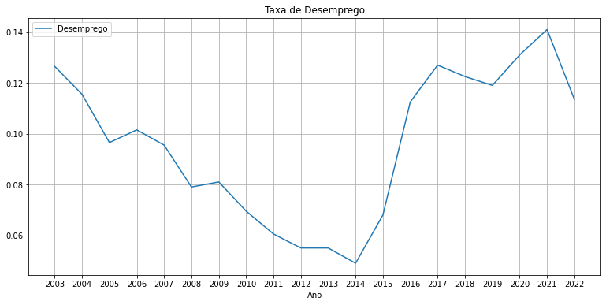
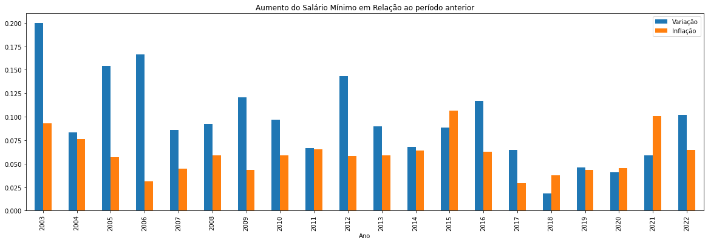
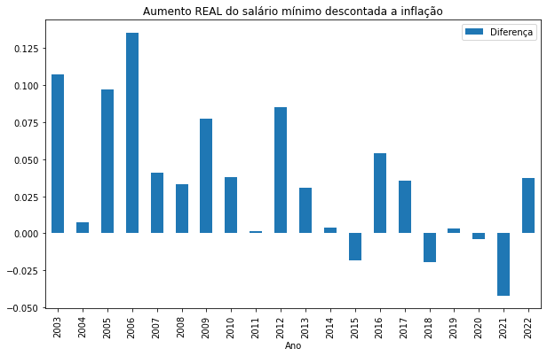
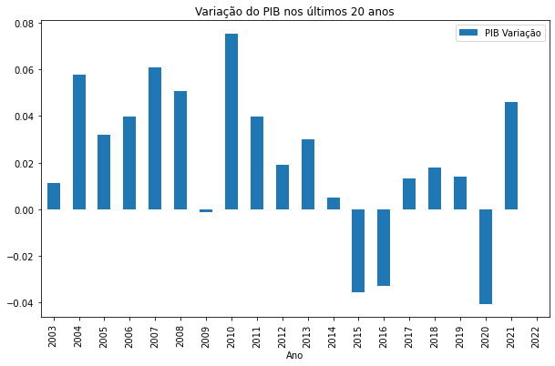
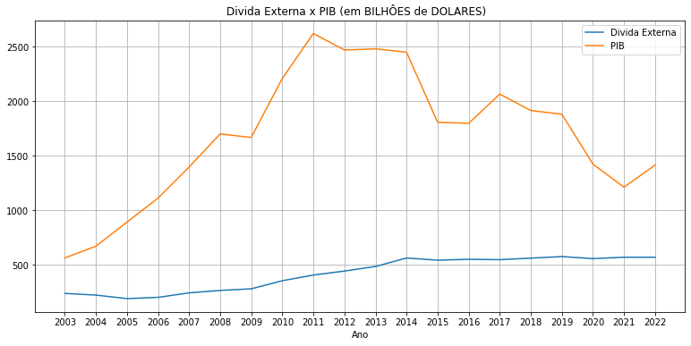
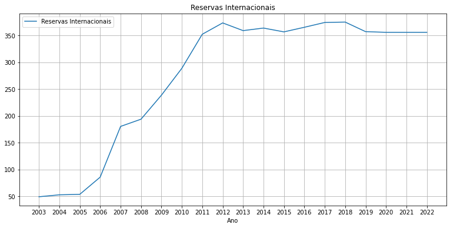
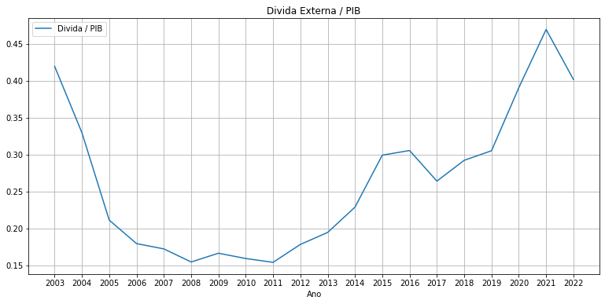

<!DOCTYPE html>
<html>
<head>
<title>Brasil em DADOS</title>

</head>
<body>

<h1>
Brasil em FATOS
</h1>

Meu querido amigo Marcão. Fiquei bastante contente quando ouvi seu áudio dizendo que "contra dados e fatos não há argumentos".

Pois preparei essa apresentação para elucidar coisas que eu venho te dizendo há anos de uma maneira mais didática. Quem sabe assim você consiga observar os DADOS, entender os FATOS e finalmente perceber que existe uma diferença enorme entre FATO e OPINIÃO.

<h2>Dólar e Gasolina</h2>

Então vamos em frente, e vamos começar pelo preço do dólar. Que não é preciso explicar que mostra enfáticamente o crescimento ou diminuição da economia de um país frente ao cenário mundial.

No mesmo gráfico também temos o preço da gasolina nos ultimos 20 anos. Nota alguma semelhança? Nota como logo após 2014 tudo começa a subir exponencialmente?

<h2>Desemprego</h2>

Aqui conseguimos mais uma vez acompanhar a crise criada pela Globo e pelos golpistas a partir de 2014, para conseguirem derrubar o governo democraticamente eleito. Note como em 10 anos o PT conseguiu levar o Brasil ao pleno emprego, chegando a uma taxa de 4,5% antes de vocês começarem a fazer dancinha e reclamarem que o PT tinha quebrado o país. Aí você lembra, que a reforma trabalhista ia tirar direitos do trabalhador mas em compensação ia gerar MILHÕES de empregos? Onde eles estão?

<h2>Salário Mínimo</h2>

Aqui vemos também o AUMENTO REAL do salário mínimo, e do poder de compra do brasileiro. Vê como na era PT o aumento do salário mínimo era MUITO MAIOR que a inflação? Foi aí que o pobre fez faculdade, começou a viajar de avião, começou a comprar em lojas do shopping. Foi aí que a classe média achou que era elite e quebrou o país

Aqui você percebe que nesse desgoverno imbecil e fajuto que você defende, sequer houve aumento real do salário mínimo. O trabalhador somente deixou de poder comprar, a inflação estourou e agora o povo come osso ao invés de comer picanha. Adivinha o que houve após 2014 quando as princesas queriam ir pra Disney sem pobre do lado? E, antes que vc fale, não se iluda com a última barra. Ainda estamos em março, ela também estará negativa até o final do ano.

<h2>Pib</h2>

E finalmente chegamos ao PIB. Veja só que coisa, o PT quebrou o país TRIPLICANDO O PIB. O único ano ruim foi em 2009, lembra o que aconteceu em 2009? A bolha imobiliária americana, O MUNDO TODO QUEBROU, e o Lula disse que aqui seria apenas uma marolinha. Realmente, apenas uma marolinha, em uma nação sobrenana, sexta potência mundial, em plena ascensão, com dinheiro no cofre pra aguentar o tranco! Aí a partir de 2014 o que aconteceu? Adivinhou!!

E aqui vemos a relação PIB e dívida externa do país.

E se o PIB sobe muito, e a dívida externa não? Advinha o que acontece? As nossas reservas internacionais sobem tambem. Isso é o que o Brasil tem de dólar guardado pra utilizar em uma crise como a que aconteceu com a pandemia! Boslonaro usou? Não!!! Ele preferiu incentivar aglomeração, o uso de medicamento sem comprovação, e roubar dinheiro de vacina.

E vocês dizem que o PT quebrou o país! Quebrou como exatamente se ele deixou 350 BILHOES DE DÓLARES EM CAIXA?

E aqui a gente acompanha o quanto a dívida externa do país representa do PIB. O que o governo golpista e mais o governo incompetente que você votou fez foi voltar o Brasil no patamar que era em 2002. Parabéns! Jogamos 20 anos de avanço no lixo.

<h2>CONCLUSÃO</h2>

Baseado nesses DADOS podemos concluir que é FATO que você foi enganado. Foi ingênuo de acreditar que o país estava quebrado, que precisavamos de uma reforma trabalhista, de uma reforma da previdência. Talvez agora que você é dono e não mais empregado já não se importe mais com direitos trabalhistas. Afinal, quanto menos direitos, mais dinheiro no seu bolso.

A verdade é que você acreditou na narrativa dos 1% dos 1% mais ricos que se beneficiaram com as reformas, com a queda do governo. Você foi manipulado. Ou não enxerga isso porque ainda continua sendo ingênuo, ou enxerga e tem vergonha de admitir que apoiou o impeachmant baseado em narrativas vazias que recebeu no whatsapp e que votou em um completo incompetente pelo mesmo motivo.

E por favor, não venha me dizer "Estamos pagando a conta que o PT deixou", porque essa é mais uma narrativa chula pra enganar as pouquíssimas pessoas que tentaram pesquisar por conta própria sobre a situação do país. Como eu mostrei, temos BILHÕES de dólares de reserva. Não existe o Brasil quebrado. O que existe é uma elite que você admira, tentando figir que o PT quebrou o país, para que todo mundo apoiasse as reformas que os deixaram ainda mais ricos.

É isso meu amigo. Fazia muito tempo que eu queria reunir todos esses dados em um só lugar. Obrigado pelo incentivo!

Grande abraço, taokei!

</body>

